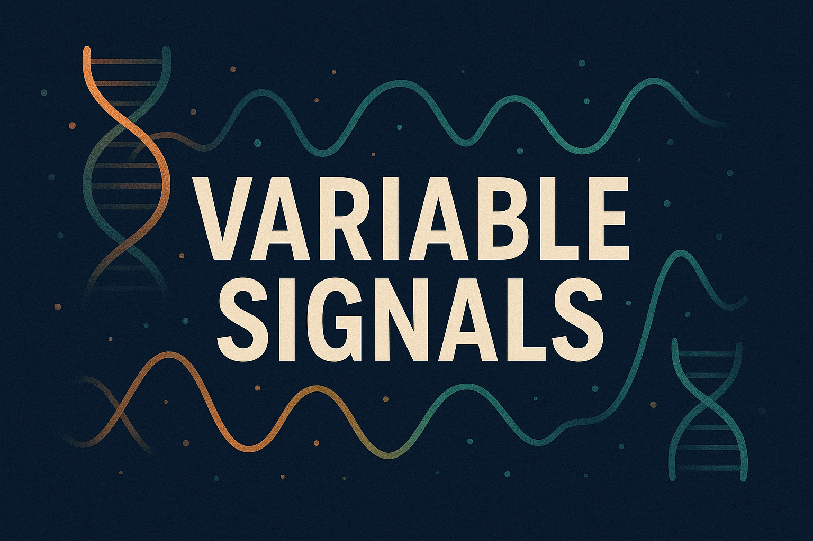

<!-- title -->

<!--lint ignore no-dead-urls-->

# Variable Signals - Awesome List of Stuff To Read  

<!-- subtitle -->

A resource for learning

<!-- image -->

<!-- description -->

A curated list of cutting-edge research articles and blog posts across genomics, neuroscience, psychology, and AI.

<!-- TOC -->

## Contents

- [Follow](#follow)

<!-- CONTENT -->

# 🧬 Awesome Research in Genomics, AI, and Clinical Science

A curated collection of cutting-edge studies, tools, and guidelines across biomedical domains.

---

## 📊 Omics Data Analysis & Visualization
- [Best practices and tools in R and Python for statistical processing and visualization of lipidomics and metabolomics data | Nature Communications](https://www.nature.com/articles/s41467-025-63751-1)  
  A comprehensive guide for robust and reproducible chemometric analysis using R and Python.

---

## 🔬 Genomics & Population Health
- [Somatic mutation and selection at population scale | Nature](https://www.nature.com/articles/s41586-025-09584-w)  
  Explores how somatic mutations evolve and are selected across large populations.
- [Population-scale gene-based analysis of whole-genome sequencing provides insights into metabolic health | Nature Genetics](https://www.nature.com/articles/s41588-025-02364-2)  
  Gene-based insights into metabolic traits from large-scale sequencing.
- [Deep generative modeling of sample-level heterogeneity in single-cell genomics | Nature Methods](https://www.nature.com/articles/s41592-025-02808-x)  
  Modeling cellular diversity using deep generative approaches.

---

## ⚡ Rapid Sequencing & Genomics
- [Broad Clinical Labs Sets New GUINNESS WORLD RECORDS™ Title for Fastest DNA Sequencing Technique](https://broadclinicallabs.org/broad-clinical-labs-sets-new-guinness-world-records-title-for-fastest-dna-sequencing-technique/)  
  Record-breaking speed in DNA sequencing technology.
- [Toward Same-Day Genome Sequencing in the Critical Care Setting | NEJM](https://www.nejm.org/doi/full/10.1056/NEJMc2512825)  
  Exploring real-time genome sequencing for urgent clinical decisions.
- [Population-scale Long-read Sequencing in the All of Us Research Program | medRxiv](https://www.medrxiv.org/content/10.1101/2025.10.02.25336942v1)  
  Long-read sequencing at national scale for diverse populations.
- [Genotyping sequence-resolved copy number variation using pangenomes | Nature Genetics](https://share.google/tK2vjdTq9XauZpjxB)  
  Reveals global diversity and expression divergence in duplicated genes.
- [Phenome-wide association study of sex chromosome trisomies | AJHG](https://www.cell.com/ajhg/abstract/S0002-9297(25)00287-3)  
  Large-scale analysis across MVP, FinnGen, and UK Biobank.

---

## 🧠 Neuroscience & Psychology
- [Statistical evidence in psychological networks | Nature Human Behaviour](https://www.nature.com/articles/s41562-025-02314-2)  
  Advances in statistical modeling for psychological network analysis.
- [A phenotypic brain organoid atlas for neurodevelopmental disorders | bioRxiv](https://www.biorxiv.org/content/10.1101/2025.09.12.675864v1?s=08)  
  Brain organoid-based phenotypic mapping for neurodevelopmental research.

---

## 🧠 AI & Bioinformatics Tools
- [Rapid Development of Omics Data Analysis Applications through Vibe Coding | arXiv](https://doi.org/10.48550/arXiv.2510.09804)  
  Accelerating omics app development with Vibe Coding.
- [CGBENCH: Benchmarking Language Model Scientific Reasoning for Clinical Genetics Research | arXiv](https://arxiv.org/abs/2510.11985)  
  Evaluating LLMs for scientific reasoning in genetics.
- [AlphaDIA enables DIA transfer learning for feature-free proteomics | Nature Biotechnology](https://www.nature.com/articles/s41587-025-02791-w)  
  Transfer learning for proteomics without feature engineering.
- [Multimodal AI for Precision Preventive Cardiology | medRxiv](https://www.medrxiv.org/content/10.1101/2025.10.09.25337677v1)  
  AI-driven approaches for personalized heart health.
- [OpenTSLM](https://opentslm.com)  
  Time-Series Language Models (TSLMs) enable reasoning and forecasting over temporal data in natural language.
  - [BioContextAI | Community hub for agentic biomedical systems](https://biocontext.ai/)
  -   Open-source Model Context Protocol (MCP) servers providing standardized access to biomedical databases and tools, enabling LLMs and AI agents to access validated scientific knowledge reliably.

---

## 🤖 AI in Biomedicine
- [Using AI to identify genetic variants in tumors with DeepSomatic | Google Research Blog](https://research.google/blog/using-ai-to-identify-genetic-variants-in-tumors-with-deepsomatic/)  
  AI-driven variant detection in oncology using DeepSomatic.

---

## 🧩 Data Integration & NLP
- [Multimodal data curation via interoperability | Nature Scientific Data](https://www.nature.com/articles/s41597-025-05678-2)  
  Use cases from the Medical Imaging and Data Resource Center.
- [Development and validation of NLP algorithms in the National EnACT Network | Cambridge](https://www.cambridge.org/core/journals/journal-of-clinical-and-translational-science/article/development-and-validation-of-natural-language-processing-algorithms-in-the-national-enact-network/408D044A5076616CCC42AB884C26011A)  
  NLP tools for clinical data extraction and analysis.

---

## 🧪 Clinical Practice & Guidelines
- [Recommendations for bioinformatics in clinical practice | Genome Medicine](https://genomemedicine.biomedcentral.com/articles/10.1186/s13073-025-01543-4)  
  Best practices for integrating bioinformatics into healthcare.
- [ESMO Guidance on the Use of Large Language Models in Clinical Practice (ELCAP) | Annals of Oncology](https://www.annalsofoncology.org/article/%20S0923-7534(25)04698-8/fulltext)  
  Expert recommendations for LLMs in oncology and clinical workflows.

<!-- END CONTENT -->

## Follow

<!-- list people worth following on social sites (Twitter, LinkedIn, GitHub, YouTube etc.) -->

Who else should we be following!?

## Contributing

[Contributions of any kind welcome, just follow the guidelines](contributing.md)!

### Contributors

[Thanks goes to these contributors](https://github.com/kevin3/variable-signals/graphs/contributors)!
